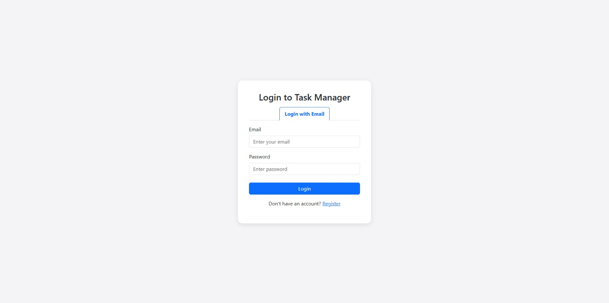
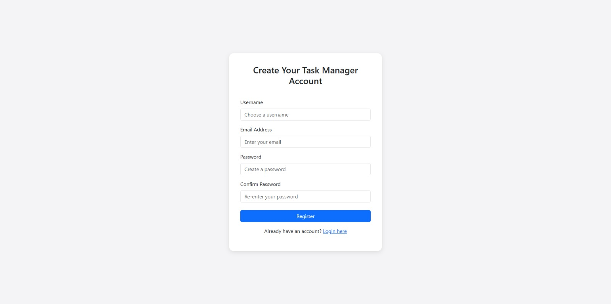
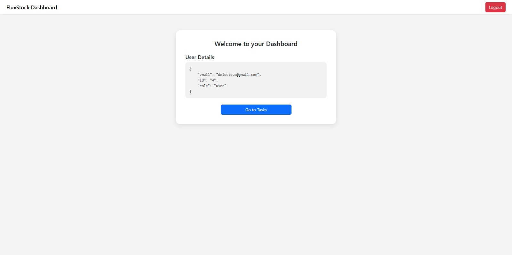

# Task Manager

A robust, production-ready Task Management System built with Python and Flask. Designed to demonstrate a modular **Service-Layer Architecture**, it features secure JWT authentication, Role-Based Access Control (RBAC), and a decoupled frontend for efficient task tracking.

---

<h2>🔐 Login View</h2>

<h2>📝 Registration View</h2>

<h2>📊 Dashboard View</h2>

## 🔧 Features

✅ User-Friendly Dashboard built with Vanilla JS

🔐 Secure Authentication using JSON Web Tokens (JWT)

🛡️ Role-Based Access Control (Admins can manage all tasks, Users manage their own)

🏗️ Service-Layer Architecture for clean, testable code

📝 Full CRUD functionality (Create, Read, Update, Delete)

🗄️ Database Migrations with Flask-Migrate

---

## 🏗️ Tech Stack

Backend: Python, Flask, Flask-JWT-Extended

Frontend: HTML, CSS, JavaScript (Fetch API)

Data Handling: SQLAlchemy (ORM), SQLite (Development)

(Architecture: Modular Factory Pattern with Service Layer)

---

## 📚 API Documentation

Explore the full API endpoints and test requests using our Postman Collection:

[**🔗 View Postman Documentation**](https://adityaraghav22-6426835.postman.co/workspace/6397efc7-5300-43ff-8331-aa42feae6d9a/documentation/49375862-af5d827b-75d1-4279-8003-465c2e7ef1f8)

--- 
## 📁 Folder Structure

/app             → Models, Routes, Services, and Utils  
/frontend        → Client-side HTML, CSS, and JS files  
/migrations      → Database migration versions  
/instance        → SQLite database file  
run.py           → Flask application entry point  
 
---

## 📌 Getting Started

Clone the repo

Install dependencies: `pip install -r requirements.txt`

Initialize Database:
`flask db init`
`flask db migrate`
`flask db upgrade`

Run the app: `python run.py`

Access at: `http://127.0.0.1:5000/`

---

## 📄 License

This project is licensed under the **MIT License**.  
Feel free to use, modify, and distribute it for personal or commercial purposes.  

See the [LICENSE](LICENSE) file for full license text.
